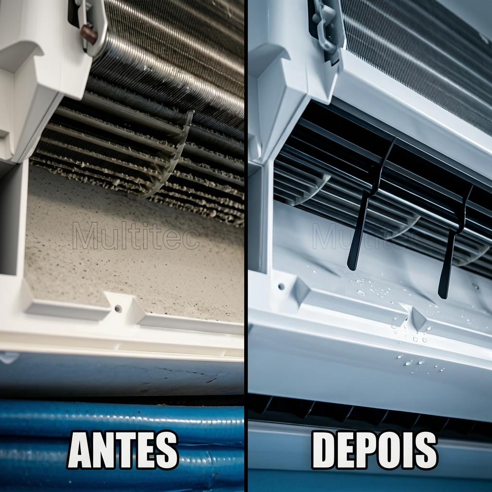
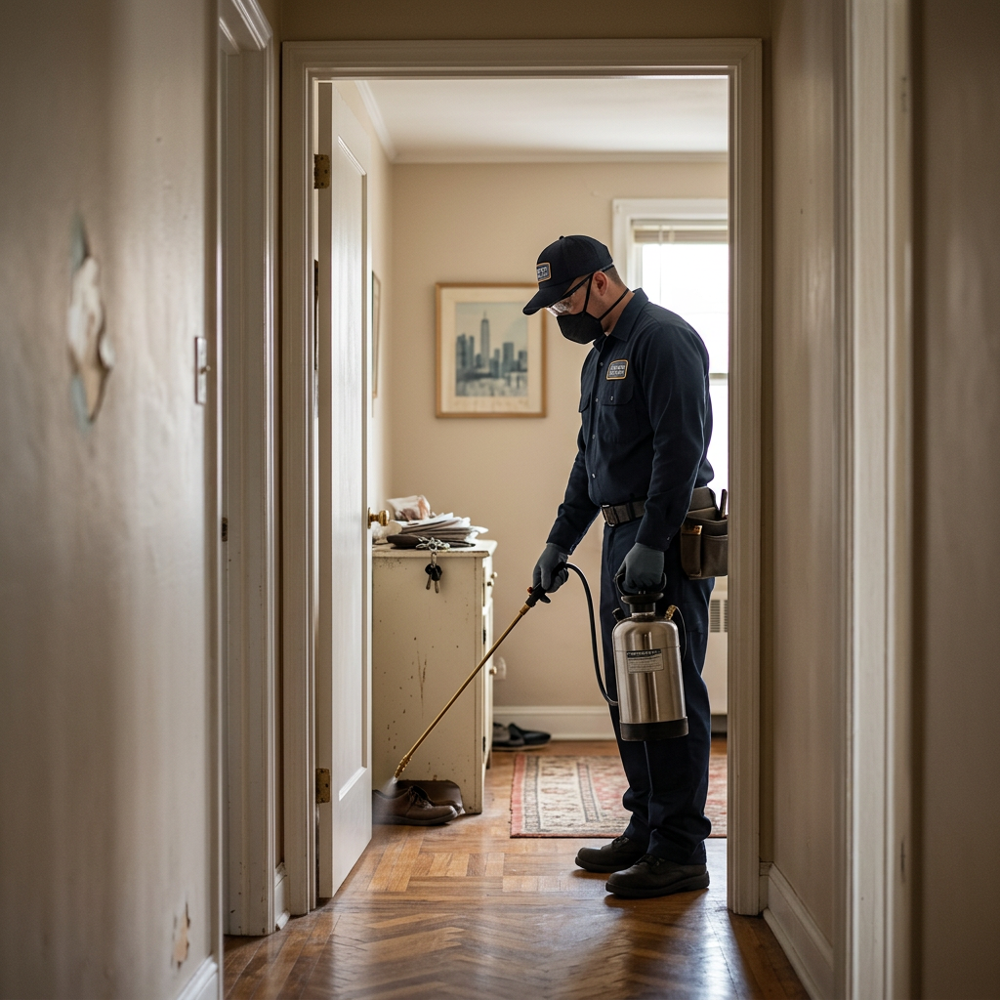

<!-- =========================
MULTITEC - SITE PREMIUM COMPLETO
HTML + CSS + JAVASCRIPT
Pronto para rodar
========================= -->

<!DOCTYPE html>
<html lang="pt-BR">
<head>
  <meta charset="UTF-8" />
  <meta name="viewport" content="width=device-width, initial-scale=1.0" />

  <title>MULTITEC | Climatização & Dedetização</title>

  <!-- SEO -->
  <meta name="description" content="MULTITEC - Especialistas em climatização e dedetização com atendimento rápido, tecnologia avançada e resultado garantido.">
  <meta name="keywords" content="climatização, dedetização, ar condicionado, limpeza de ar, controle de pragas">
  <meta name="author" content="MULTITEC">

  <!-- Favicon -->
  <link rel="icon" href="logonova.png">

  <!-- Font -->
  <link rel="preconnect" href="https://fonts.googleapis.com">
  <link href="https://fonts.googleapis.com/css2?family=Inter:wght@300;400;500;600;700;800;900&display=swap" rel="stylesheet">

  <!-- ICONS -->
  <link rel="stylesheet" href="https://cdnjs.cloudflare.com/ajax/libs/font-awesome/6.5.2/css/all.min.css">

  
</head>

<body>

<!-- =========================
HEADER
========================= -->

<header>

  

    

      
      MULTITEC
    

    <nav>
      <ul>
        <li><a href="#climatizacao" id="menuClima">Climatização</a></li>
        <li><a href="#dedetizacao" id="menuDede">Dedetização</a></li>
        <li><a href="#comentarios">Comentários</a></li>
      </ul>
    </nav>

  

</header>

<!-- =========================
HERO
========================= -->

<section class="hero">

  <!-- TROCAR IMAGEM AQUI -->
   <video autoplay muted loop playsinline>
    <source src="VIDEO FUNDO DEDETIZAÇÃO.mp4" type="video/mp4">
  </video>

  

  

    <h1>
      Soluções completas em dedetização e climatização com resultado garantido
    </h1>

    <a href="https://wa.me/5583993068784" class="btn" target="_blank">
      <i class="fa-brands fa-whatsapp"></i>
      ATENDIMENTO RÁPIDO
    </a>

  

</section>

<!-- =========================
CARDS
========================= -->

<section>

  

    <h2 class="section-title">
      Por que escolher a Multitec
    </h2>

    

      

        <i class="fa-solid fa-bolt"></i>
        <h3>Atendimento rápido</h3>
        
Equipe preparada para atender com agilidade.

      

      

        <i class="fa-solid fa-user-shield"></i>
        <h3>Equipe especializada</h3>
        
Profissionais treinados e qualificados.

      

      

        <i class="fa-solid fa-award"></i>
        <h3>Resultado garantido</h3>
        
Serviços eficientes e duradouros.

      

      

        <i class="fa-solid fa-microchip"></i>
        <h3>Tecnologia avançada</h3>
        
Equipamentos modernos e produtos premium.

      

    

  

</section>

<!-- =========================
CLIMATIZAÇÃO
========================= -->

<section id="climatizacao">

  

    

      
  

    

      <h2 class="section-title">Climatização</h2>

      

       Manutenção e limpeza completa para seu ar-condicionado.
      

      <form id="climaForm">

       <!-- =====================================================
ALTERAÇÃO 2 — FORMULÁRIO CLIMATIZAÇÃO
SUBSTITUA APENAS A DIV .form-grid DO CLIMA
===================================================== -->

  <input
    type="text"
    id="cepClima"
    placeholder="CEP"
    required
  >

  <input
    type="text"
    id="numeroClima"
    placeholder="Número da casa"
    required
  >

  <input
    type="text"
    id="enderecoClima"
    placeholder="Endereço"
    readonly
    required
  >

  <select id="necessidade" required>

    <option value="">
      Necessidade
    </option>

    <option>Manutenção</option>
    <option>Limpeza</option>

  </select>

  <select id="quantidade" required>

    <option value="">
      Quantidade de aparelhos
    </option>

    <option>1</option>
    <option>2</option>
    <option>3 ou mais</option>

  </select>

  <input
    type="datetime-local"
    id="data"
    required
  >

  <input
    type="text"
    id="BTUs"
    placeholder="Quantidade de BTUs"
    required
  >

  <textarea
    id="info"
    placeholder="Mais informações"
  ></textarea>

         

        <button type="submit" class="btn">
          VER ORÇAMENTO
        </button>

      </form>

    

  

</section>

<!-- =========================
DEDETIZAÇÃO
========================= -->

<section id="dedetizacao">

  

    

      <h2 class="section-title">Dedetização</h2>

      

        Dedetização residencial e comercial com produtos seguros, controle eficiente de pragas e atendimento profissional.
      

      <form id="dedeForm">

        <!-- =====================================================
ALTERAÇÃO 3 — FORMULÁRIO DEDETIZAÇÃO
SUBSTITUA APENAS A DIV .form-grid DA DEDETIZAÇÃO
===================================================== -->

  <select id="tipoLocal" required>

    <option value="">
      Tipo do local
    </option>

    <option>Casa</option>
    <option>Apartamento</option>
    <option>Comércio</option>

  </select>

  <select id="comodos" required>

    <option value="">
      Quantidade de cômodos
    </option>

    <option>1</option>
    <option>2</option>
    <option>3</option>
    <option>4</option>
    <option>5 ou mais</option>

  </select>

  <select id="praga" required>

    <option value="">
      Qual praga?
    </option>

    <option>Barata</option>
    <option>Formiga</option>
    <option>Cupim</option>
    <option>Rato</option>
    <option>Aranha</option>
    <option>Escorpião</option>
    <option>Mosquito</option>
    <option>Pulga</option>
    <option>Carrapato</option>
    <option>Percevejo</option>
    <option>Traça</option>

  </select>

  <select id="pets" required>

    <option value="">
      Tem crianças ou pets?
    </option>

    <option>Sim</option>
    <option>Não</option>

  </select>

  <input
    type="text"
    id="cepDede"
    placeholder="CEP"
    required
  >

  <input
    type="text"
    id="numeroDede"
    placeholder="Número da casa"
    required
  >

  <input
    type="text"
    id="enderecoDede"
    placeholder="Endereço"
    readonly
    required
  >

  <textarea
    id="infoDede"
    placeholder="Mais informações"
  ></textarea>

         

        <button type="submit" class="btn">
          VER ORÇAMENTO
        </button>

      </form>

    

    

      
    

  

</section>

<!-- =========================
COMENTÁRIOS
========================= -->

<section id="comentarios">

  

    <h2 class="section-title">Comentários dos clientes</h2>

    

      

        <i class="fa-solid fa-star"></i>
        <i class="fa-solid fa-star"></i>
        <i class="fa-solid fa-star"></i>
        <i class="fa-solid fa-star"></i>
        <i class="fa-solid fa-star"></i>
      

      <input type="text" placeholder="Seu nome" id="nomeComentario">
        
      <textarea placeholder="Seu comentário" id="textoComentario"></textarea>

        

      <button class="btn" id="enviarComentario">
        Publicar comentário
      </button>

    

    

  

</section>

<!-- =========================
WHATSAPP
========================= -->

<a 
href="https://wa.me/5583993068784"
target="_blank"
class="whatsapp-fixed">

<i class="fa-brands fa-whatsapp"></i>

</a>

<!-- =========================
FOOTER
========================= -->

<footer>

  

    <a href="#">
      <i class="fa-brands fa-instagram"></i>
    </a>

    <a href="#">
      <i class="fa-brands fa-whatsapp"></i>
    </a>

  

  © MULTITEC - Todos os direitos reservados

</footer>

<!-- =========================
JS
========================= -->

</body>
</html>
